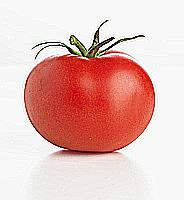

# Semantic Segmentation Of Tomatoes


## First Day

### Intro
Today we learned how to use `PIL` library in Python in order to edit and work with images.

We covered various type of transformations of photos, colors and shapes.

### PIL Features



An example of sharpening photo in order to facilitate the learning the tomato. 
We used this line of code: 
```python
from PIL import Image, ImageFilter

image = Image.open("Tomato.jpg")
image.filter(ImageFilter.EDGE_ENHANCE_MORE)
```

We also tried invert photos: 


with this code:
```python
from PIL import Image, ImageChops

image = Image.open("Tomato.jpg")
ImageChops.invert(image)
```

And we done a lot of other transformations.

### Cropping
We have created a function that divides image to overlapping sub-images.
This is the code we used:
```python
def createCrops(im, step_x, step_y, crop_x, crop_y):
    res = []
    for up in range(0, im.size[1] - crop_y, step_y):
        for left in range(0, im.size[0] - crop_x, step_x):
            cropped = im.crop((left, up, left+crop_x, up+crop_y))
            res.append(cropped)

    return res
```

Here is part of the results for using crop on a 500x500 image. 

the parameters used are crop width and height of 150 and stride of 120:


### Color Spaces And Random Ones
We have experimented different types of color spaces transformations.

We wrote code that transform color space:
```python
# func is the function that changes the RGB triplet
# into other color space
def change_color_space(image, func):
    h, w = image.size
    res = Image.new("RGB", image.size, (255, 255, 255))

    for i in range(h):
        for j in range(w):
            res.putpixel((i, j), func(image.getpixel((i, j))))

    return res
```

First thing that we tried is to transform RGB into YUV with this function:
```python
import math
import numpy as np

def float_to_short(f):
    return math.ceil(f) % 256

def rgb_transform(A, rgb):
    r, g, b = rgb
    c = A @ np.array([r, g, b])
    r, g, b = float_to_short(c[0]), float_to_short(c[1]), float_to_short(c[2])
    return r, g, b

def rgb2uyv(rgb):
    A = np.array([[-0.1471, -0.2889, 0.4360],
                  [0.2990, 0.5870, 0.1140],
                  [0.6150, -0.5150, -0.1000]])

    return rgb_transform(A, rgb)
```
Here is photo of the result:


 Later we came up with the idea of make a random color space transformation.
 We hope that using it will improve the results of the learning.  We tried several distributions.
 Here is the code with exponential distribution:
 
 ```python
import numpy as np
 
def random_color_space(image):
    image = image.convert("RGB")
    A = np.random.exponential(1/7, (3, 3))
    b = np.random.rand(3)
    return change_color_space(image, lambda x: add_tuples(rgb_transform(A, x), b))
```
 
Here is picture before transformation:


Here is the picture after transformation ( the tomatoes gets different colors from the rest of the picture):


> We should be careful when using this method because wild <br />
 distributions and parameters could lead to wild images, for instance:

 
 


## Second Day

### Transformations
We will start working on Affine transformations to pictures.
First we the image to the center of all image that it won't cut after transformation.
For example this image:

 

here is the picture after the change:


We created 3 different affine transformations on images in order to make more diversed data set for the training.

Here are some examples:

 
 
 

We came up with the idea of refining the transformation from yesterday by making several transformation for every category.

### Neural Network
Finally we started building the neural network.


#### Architecture
We created a neural network with the following architecture:
```python
from tflearn.layers.conv import conv_2d, max_pool_2d
from tflearn.layers.core import input_data, dropout, fully_connected
from tflearn.layers.estimator import regression
from tflearn.layers.normalization import batch_normalization

NN = input_data(shape=[None, 128, 128, 3], name='input')

NN = conv_2d(NN, 32, 2, activation='relu')
NN = max_pool_2d(NN, 2)
NN = batch_normalization(NN)

NN = fully_connected(NN, 128, activation='relu', weights_init='xavier', bias_init='xavier')
NN = dropout(NN, 0.5)

NN = fully_connected(NN, 5, activation='softmax')

NN = regression(NN, optimizer='adam', learning_rate=0.01, loss='categorical_crossentropy', name='targets')
``` 

We can see that we have shallow neural network with only one convolution part and one hidden layer.

>This architecture is shallow because our laptop's cpu is slower then the gpu's in the lab and we have only this for now.

Here we can the result from today (71.63% accuracy):


#### Augmentation
We added augmentation to our neural network with the following lines:

```python
from tflearn import ImageAugmentation

img_aug = ImageAugmentation()
img_aug.add_random_flip_leftright()
img_aug.add_random_rotation(max_angle=25.)
```

In order to improve our network results.

### Preprocessing
We came up with the idea of generating data sets using external softwares, e.g. Matlab, since we will do it only once.

## Third Day

### Model Ensemble And Our Idea
Model ensemble is the idea of training several neural networks of the same 
architecture with different initialization at training time and at testing time use the median of their result.
#### Our Idea
Train several neural networks of different architecture and train
a network that receive as input all the rest of the architecture's out and
and the result is the classification.

### First Model Results
We've trained a model on Eitan's computer (CPU) over-night and got a working model with accuracy.
The graph below shows the accuracy of the model as a function of the training step.
The whole session took 13 hours on a quad-core i5 cpu.


### Moved to OpenCV instead of PIL
The OpenCV library for python seemed to be a better choice for our needs, so we decided to use it instead of PIL

### Tools-Set for classification of generating the output
The input for the classifier is a list of crops, taken from a big image.
We classify each sub-image and later map it to a unique color that we associate with it's class. This is the color of the corresponding pixel in the output.
 
```python
def apply_classification(image_list):
    model = custom_network()
    model.load('../NN/first.model')
    lst = []
    for im in image_list:
        im = im.reshape(-1, 128, 128, 3)
        res = model.predict(im)
        lst.append(np.argmax(res))
    return lst

```

Later, we generate the new image based on the data from the classifier:

```python
# 0 - bad leaf
# 1 - fruit
# 2 - leaf
# 3 - other
# 4 - stem
keys = [0, 1, 2, 3, 4]
colors = [[0, 0, 255], [255, 0, 0], [0, 255, 0], [0, 255, 255], [255, 255, 0]]

dict = dict(zip(keys, colors))


def keys2img(vals, height, width):
    res = []
    for item in vals:
        res.append(dict.get(item))

    return np.reshape(res, (height, width, 3))
```

## Fourth Day
### Fixed colors keys to colors translation
We had to convert the arrays to type uint8 since the function "imshow" accepts this type

### New Idea: Color Picker
We thought about embedding a color picker so that the user could the color applied for each class after classification


## Fifth Day
### Use Gamma Correction As A Pupil


We came up with the idea of training 2 Neural network.
One that do the classifying and one the will be pupil network.


 
We will train alternatively both model.

The pupil network will receive image and will plot positive number
which will be the gamma correction.

 


## Sixth Day
### First Reasonable Results
Today we finally got good results of semantic segmentation:

Here we can see our first result:


Here is a try to improve segmentation with smaller stride:
 


### Transformation
We used perspective transformations and rotations in order to create more patches.

On each patch we applied our gamma correction.


### Patches Size
We saw that small patches are good for non green parts like tomatoes and ground.

So we make different size of patches according to the patch color.


#### Different Size Of Crops And Strides  
We thought that instead of using strides of 16 pixels we will use strides of the minimum that our
allocated gpu can handle in order to improve the goodness of the segmentation.

In addition we made different sized of patches which isn't a rectangle.

## Seventh Day
### Confusion Matrix
We created confusion matrix on our validation in order to 

spot the categories our neural net get confused with.


### Additional Net
We saw that our neural network frequantly get confused with the categories of leafs and other.
So we trained new neural network that classify on this types only and our net will run after the general net work.
